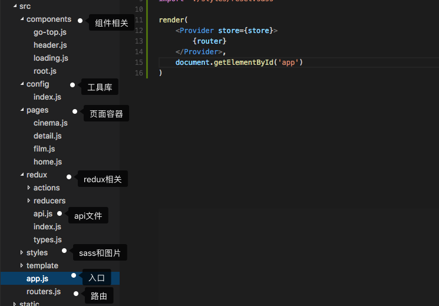

# React实战：模仿卖座电影
> 使用React.js全家桶仿制[卖座电影](http://m.maizuo.com/v4/?co=maizuo)
>
> 仓库：[https://github.com/ChuckCZC/react-demo-maizuo](https://github.com/ChuckCZC/react-demo-maizuo)

## 声明

该项目所用到的API均来自 [卖座电影](http://m.maizuo.com/v4/?co=maizuo) ，采用chrome 开发者工具分析出来的，只是为了得到数据进行排版练习，完全出于学习用途，并无恶意，请卖座电影官方海涵。

## 参考资料

React.js文档 : [http://reactjs.cn/react/docs/getting-started.html](http://reactjs.cn/react/docs/getting-started.html)

react-router文档 : [http://www.uprogrammer.cn/react-router-cn/index.html](http://www.uprogrammer.cn/react-router-cn/index.html)

Redux文档 : [http://www.redux.org.cn/](http://www.redux.org.cn/)

轮播插件swiper : [https://github.com/voronianski/react-swipe](https://github.com/voronianski/react-swipe)

数据请求axios : [https://www.npmjs.com/package/axios](https://www.npmjs.com/package/axios)

项目手脚架：[https://github.com/SidKwok/react-webpack-boilerplate](https://github.com/SidKwok/react-webpack-boilerplate)

## 项目结构



> ps:代码有关的一些知识点用注释写在相关的代码附近

## 界面预览


> ps：只是模仿了以上页面，这几个页面感觉已经包括了react的常用功能了，后面的页面则是跳去卖座电影的官网了；由于只是几个页面，故各个页面没有将相关的子项分离成组件，如果项目庞大，建议分离成组件形式，由于先写vue版本再写react版本，所以写起来比较快~

##### 最后，如果该demo对你学习react.js有帮助，麻烦给个star，谢谢#####

## Build 

``` bash
# install dependencies
npm install

# serve with hot reload at localhost:8080
npm run dev

# build for production with minification
npm run build
```
